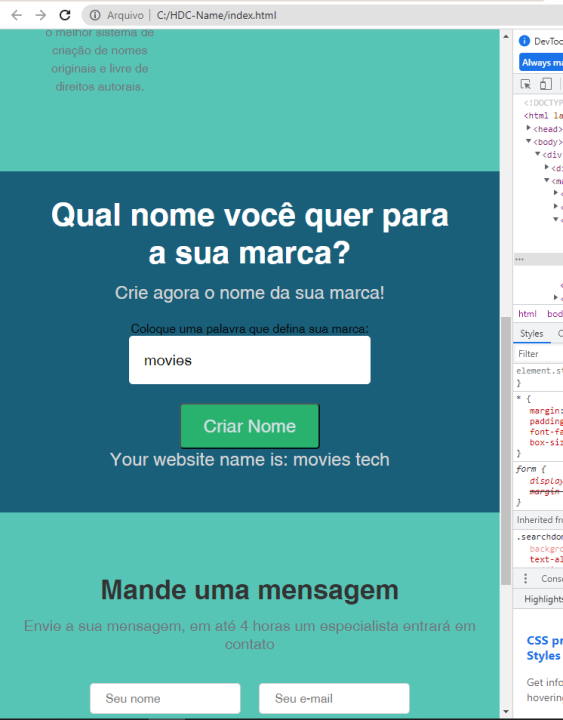

<h1>Name Generator</h1>
  

<h2>Project Deploy</h2>
 <a href="https://hdc-name-bob0cnzeb-lucaslandivar.vercel.app">Click here</a>
  
<h2>Description of the project</h2>

I've always had a hard time creating or thinking of a name for my projects (I think I noticed it in my previous projects) so I decided to use this as a challenge for my next project, where I made a website using HTML, CSS and JavaScript.

 

<h2>Why i make this project?</h2>

I make this project so i can learn how to make JavaScript generate things and random names and adding those names into the value the user gives me.

<h2>How does this project work?</h2>

When you write a word, the word you wrote return with a word Generate from JavaScript.

<h2>Tecnologies</h2>

HTML

CSS

JavaScript

<h2>Status</h2>

Finish.

<h2>Author</h2>

Lucas Landivar de Morais

